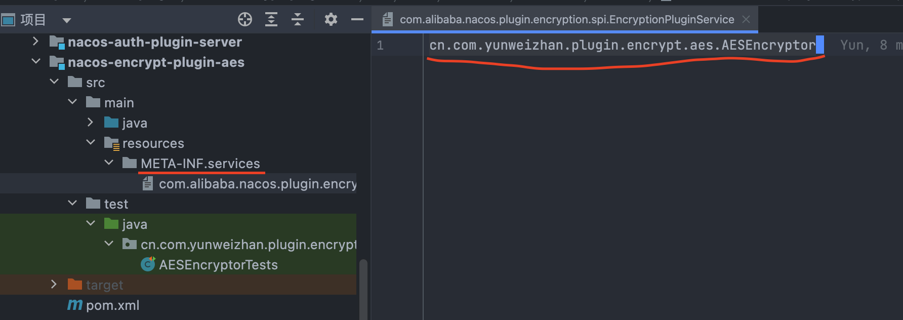
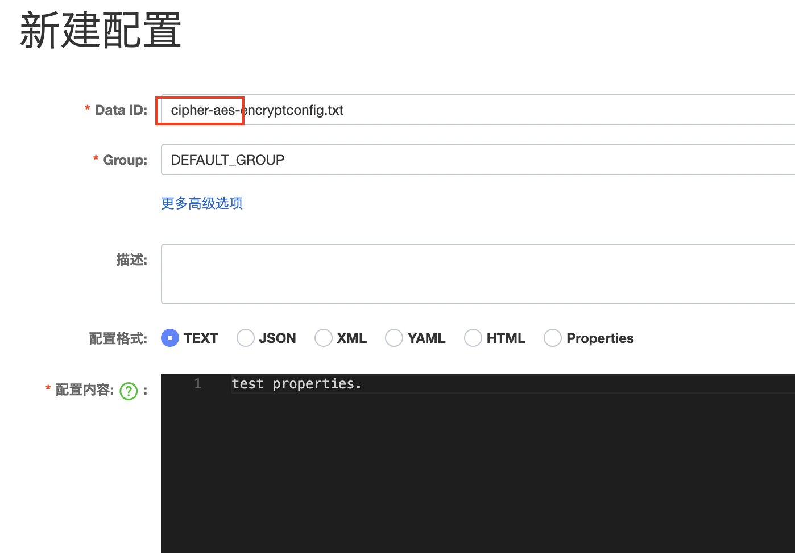

== 配置加密插件开发

下面以开发基于对称加密算法AES的加密插件为例进行介绍。

=== 引入相关依赖

在插件开发项目中引入如下依赖模块：

[source, xml]
----
		<dependency>
			<groupId>com.alibaba.nacos</groupId>
			<artifactId>nacos-encryption-plugin</artifactId>
			<version>2.1.0</version>
		</dependency>
----

=== 实现加解密逻辑

[source, java]
----
public class AESEncryptor implements EncryptionPluginService {
	private static final String AES_PRIVATE_KEY;

	private static final String ALGORITHM = "AES";

	static {
		try {
			KeyGenerator instance;
			instance = KeyGenerator.getInstance(ALGORITHM);
			instance.init(128);
			AES_PRIVATE_KEY = new String(instance.generateKey().getEncoded(), StandardCharsets.UTF_8);

		}
		catch (NoSuchAlgorithmException e) {
			throw new RuntimeException(e);
		}
	}

	@Override
	public String encrypt(String secretKey, String content) {
		String encryptedContent = content;

		try {
			Cipher cipher = Cipher.getInstance(ALGORITHM);
			cipher.init(Cipher.ENCRYPT_MODE, new SecretKeySpec(secretKey.getBytes(StandardCharsets.UTF_8), ALGORITHM));
			encryptedContent = Base64.getEncoder()
					.encodeToString(cipher.doFinal(content.getBytes(StandardCharsets.UTF_8)));
		}
		catch (NoSuchPaddingException | IllegalBlockSizeException | NoSuchAlgorithmException | BadPaddingException |
			   InvalidKeyException ignored) {

		}

		return encryptedContent;
	}

	@Override
	public String decrypt(String secretKey, String content) {
		String sourceContent = content;
		try {
			Cipher cipher = Cipher.getInstance(ALGORITHM);
			cipher.init(Cipher.DECRYPT_MODE, new SecretKeySpec(secretKey.getBytes(StandardCharsets.UTF_8), ALGORITHM));
			sourceContent = new String(cipher.doFinal(Base64.getDecoder().decode(content)), StandardCharsets.UTF_8);
		}
		catch (NoSuchPaddingException | IllegalBlockSizeException | NoSuchAlgorithmException | BadPaddingException |
			   InvalidKeyException ignored) {

		}

		return sourceContent;
	}

	public String generateSecretKey() {
		return AES_PRIVATE_KEY;
	}

	@Override
	public String algorithmName() {
		return ALGORITHM.toLowerCase(Locale.ROOT);
	}

	@Override
	public String encryptSecretKey(String secretKey) {
		return secretKey;
	}

	@Override
	public String decryptSecretKey(String secretKey) {
		return secretKey;
	}
}
----

=== 配置SPI文件

在项目的 `resources/META-INF/services` 目录下创建文件 `com.alibaba.nacos.plugin.encryption.spi.EncryptionPluginService` ，并将上面的插件类完整地址填入文件中。如下图所示：

.SPI文件内容

=== 打包模块

执行以下命令构建maven模块并安装到本地maven仓库:
[source, shell]
----
mvn compile package install
----

IMPORTANT: 生产项目开发时可能还需要把该项目部署到私有仓库。

=== 在Nacos服务端和客户端中引入上一步骤构建的依赖

[source, xml]
----
        <dependency>
            <groupId>cn.com.yunweizhan</groupId>
           <artifactId>nacos-encrypt-plugin-aes</artifactId>
            <version>0.1</version>
        </dependency>
----

=== 验证插件

==== 在控制台创建配置文件

如图所示，创建配置文件时 `dataId` 必须以 *cipher-aes-* 开头：

==== 验证配置文件被加密

在数据库表 `config_info` 中找到对应的配置记录，可以看到其 `encrypted_data_key` 字段保存了密钥且 `content`字段保存的配置内容是密文。

=== 完整项目参考地址

https://github.com/YunWZ/nacos-examples/tree/main/nacos-plugin/nacos-encrypt-plugin-aes[nacos-encrypt-plugin-aes]

=== 参考文章
https://nacos.io/zh-cn/docs/config-encryption.html[Nacos-配置加密插件]